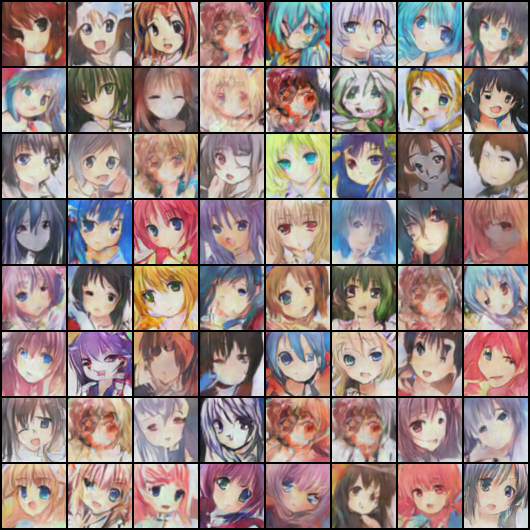
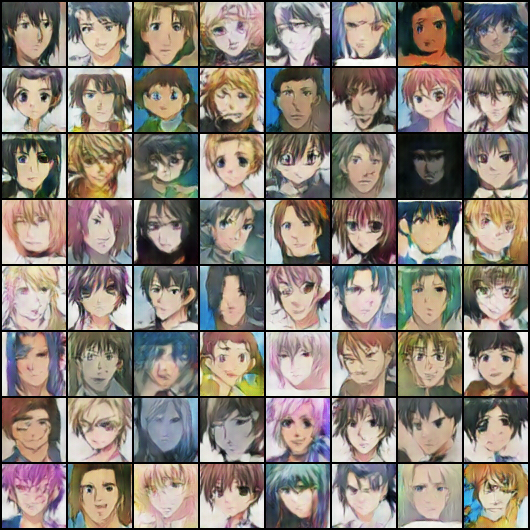
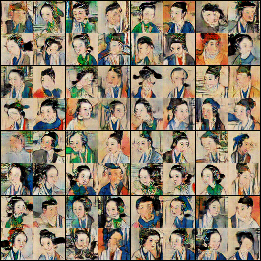

# WGAN

This project is based on [pytorch examples](https://github.com/pytorch/examples)

This project includes two parts, one is the original DCGAN modified(slightly) based on the page mentioned above which is gan.py, the other is WGAN GP which is wgan.py

## Downloading the dataset
You can download the  dataset from [here]()

## Usage
you can use these commands to start your train with GAN or WGAN
```
python wgan.py --dataset folder --dataroot DATAROOT --cuda --outf OUTPUTFILE  --niter 100
python gan.py --dataset folder --dataroot DATAROOT --cuda --outf OUTPUTFILE  --niter 100
```
in which
* **folder** means use diy dataset
* **DATAROOT** should be a folder with another folder in it. Pictures should be in the second folder.
* **--cuda** means use GPU
* **niter** is how many epochs you want to train.

To **continue** your train, you can use this command
```
python wgan.py --dataset folder --dataroot --cuda --outf OUTPUTFILE  --niter 100 --iter_num 81 --netD PATHD --netG PATHG
```
in which
* **PATHD** is your previous trained model which is saved in OUTPUTFILE
* **PATHG** is your previous trained model which is saved in OUTPUFILE
* **iter_num** is epoch which you start from.

```
optional arguments:
  -h, --help            show this help message and exit
  --dataset DATASET     cifar10 | lsun | imagenet | folder | lfw
  --dataroot DATAROOT   path to dataset
  --workers WORKERS     number of data loading workers
  --batchSize BATCHSIZE
                        input batch size
  --imageSize IMAGESIZE
                        the height / width of the input image to network
  --nz NZ               size of the latent z vector
  --ngf NGF
  --ndf NDF
  --niter NITER         number of epochs to train for
  --lr LR               learning rate, default=0.0002
  --beta1 BETA1         beta1 for adam. default=0.5
  --cuda                enables cuda
  --ngpu NGPU           number of GPUs to use
  --netG NETG           path to netG (to continue training)
  --netD NETD           path to netD (to continue training)
```

## My results

Training data is from [here](https://zhuanlan.zhihu.com/p/24767059)

